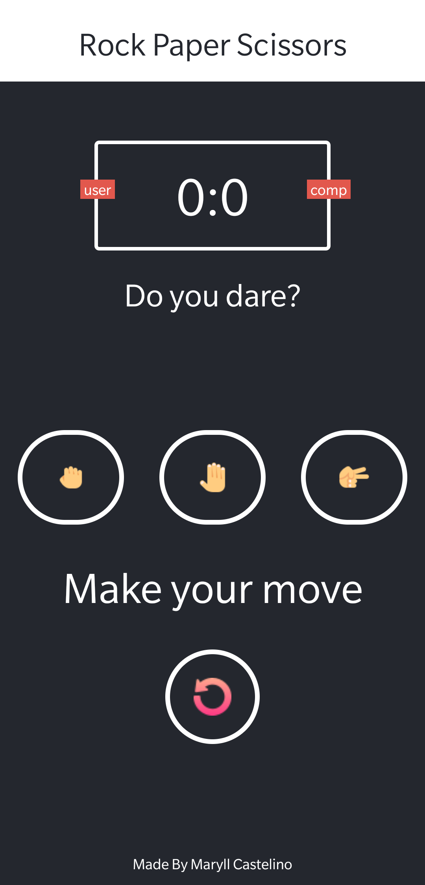

# Rock Paper Scissors
Rock Paper Scissors mobile app built with React Native using the [expo-cli](https://expo.io/).



<!-- GETTING STARTED -->
## Getting Started

To get a local copy up and running follow these simple example steps.


### Installation

1. Clone the repository:
   ```sh
   git clone https://github.com/llyram/RPS-React-Native.git
   ```
2. cd into the working directory & Install npm packages:
   ```sh
   cd RPS-React-Native 
   npm install
   ```
3. Start the Project:
   ```sh
   npm start
   ```

<!-- Contributing -->
## Contributing

Contributions are what make the open source community such an amazing place to learn, inspire, and create. Any contributions you make are **greatly appreciated**.

If you have a suggestion that would make this better, please fork the repository and create a pull request. You can also simply open an issue with the tag "enhancement".
Don't forget to give the project a star! Thanks again!

1. Fork the Project
2. Create your Feature Branch (`git checkout -b feature/AmazingFeature`)
3. Commit your Changes (`git commit -m 'Add some AmazingFeature'`)
4. Push to the Branch (`git push origin feature/AmazingFeature`)
5. Open a Pull Request